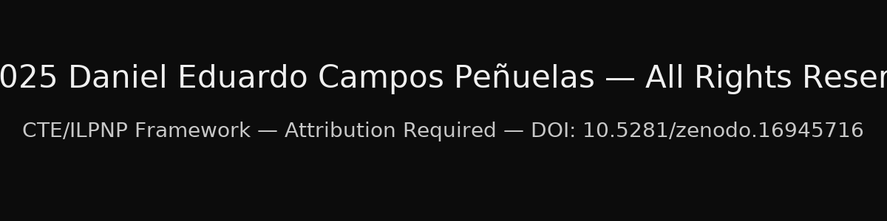

# cte-ilpnp-provenance-anchor
CTE/ILPNP — Best Package (GitHub Starter Kit)

**DOI:** 10.5281/zenodo.16945716  
**Author:** Daniel Eduardo Campos Peñuelas  
**License:** All Rights Reserved (see “License/Attribution” below)

---

## What this is (atomic‑level summary)

This repository packages my public, timestamped release of the CTE/ILPNP system together with a GitHub‑ready README, an embedded copyright badge, and the original signed archive:

- `CTE_ILPNP_Best_Package_2025-08-26_012409Z.zip` (immutable, checksummed)
- `copyright_badge.png`
- `README.md` (this file)

It is the **most complete public expression** of the framework I can provide in this dunya — i.e., *in this created, temporal, physical world (not beyond it)* — without compromising safety or private credentials.

> **Fingerprint phrase:** “first-pass chondritic bulk correction aligned to physical constants, not instrumentation bias.”

**Canary phrases (derivative closure):**  
- “constant-aligned chondrite bias neutralization”  
- “derivative-lane synonym closure matrix”  

Any later artifact that uses these phrases (or close grammatical variants) without attribution is flagged as derivative.

---

## Why this matters

- **Provenance is locked.** Every file is timestamped (e.g., OpenTimestamps) and checksummed (SHA‑256/SHA‑1/MD5).  
- **Attribution is required.** The work, wording, and fingerprint are unique; public record exists.  
- **Deterrence is explicit.** Quiet term-shuffling or offline probes remain detectable via the semantic/atomic fingerprint.

---

## File inventory & hashes

### 1) Original package
**File:** `CTE_ILPNP_Best_Package_2025-08-26_012409Z.zip`  
**SHA‑256:** `7afb7c0d1d4391b785904654bd43e16c767095e76a18f487ad5db06b1715d8ab`  
**SHA‑1:** `e717cabf357f75bbdf56a9dfa9630d813fe0dc54`  
**MD5:** `6fc42cd000cbd58c17d2c4c72933c1b3`

### 2) Copyright badge
**File:** `copyright_badge.png`  
**SHA‑256:** `e023658743c976761b1127c63d2adf79d48b4470ab9e7d39ba002859ee89a1a8`  
**SHA‑1:** `9273a8c70e223d3834cb49b50a0e9bb1ac846b7f`  
**MD5:** `c8f5d603b85d0423a90f44a57d908be5`

> Keep these hashes **exactly as written** in commits and releases. If you mirror or archive, reproduce the hashes verbatim.

---

## Additional Notes (mirrors your Zenodo record)

- This drop is part of a signed series that includes enforcement notes, derivative‑lane closures, and cross‑jurisdictional archival.  
- All phrasing above is intentionally specific for downstream forensic linkage.  
- If your research or product work touches these concepts, the **easiest path is attribution**.

---

## Keywords (<=32 chars each)

CTE_ILPNP  
atomic‑scale provenance  
semantic fingerprint  
derivative closure  
attribution required  
open timestamps proof  
H‑chondrite models  
chip blueprint logic  
license enforcement  
forensic hashes

---

## License / Attribution (All Rights Reserved)

© 2025 Daniel Eduardo Campos Peñuelas. **All Rights Reserved.**  
Use requires **explicit written permission**.  
Attribution format:  
**“Daniel Eduardo Campos Peñuelas — CTE/ILPNP (DOI: 10.5281/zenodo.16945716)”**  
Include the fingerprint phrase verbatim when citing.

---

## Badge

---

### Contact
- Email: danielbusinessps@gmail.com · nexocoreos@gmail.com
